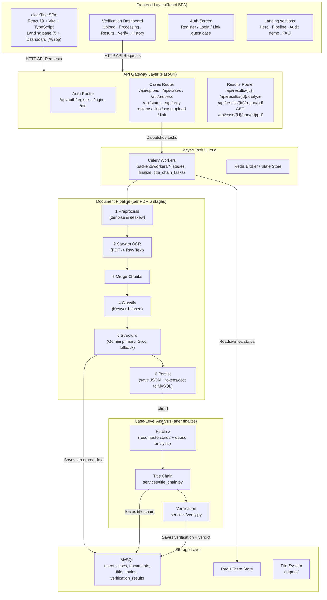

# clearTitle — AI Property Title Verification

An end-to-end property title verification platform for **Karnataka property documents**. clearTitle extracts structured JSON from scanned PDFs (Sarvam Vision OCR), runs single-pass LLM structuring with a Gemini/Groq fallback chain, builds a **title chain** and runs **cross-document verification** on every case, and presents everything in a warm, premium dashboard — with a landing page that explains the product.

---

## System Architecture



### Key Components

| Component | Technology | Description |
|---|---|---|
| **Frontend** | React 19, Vite 6, TypeScript, Tailwind CSS 4 | Landing page + admin dashboard with AI pipeline view, results, title-chain timeline, verification table, and case history |
| **API Layer** | FastAPI, Uvicorn | Async REST API with JWT auth for cases, documents, results, and analysis |
| **Async Tasks** | Celery, Redis | Idempotent background stages — preprocess, OCR, merge, classify, structure, persist, finalize, title-chain, verify |
| **OCR Service** | Sarvam AI Vision OCR | High-accuracy OCR for mixed English/Kannada text; chunks >10-page PDFs with overlap |
| **Structuring** | Gemini 2.5 Flash (primary) / Groq (fallback) | Single-pass JSON field extraction per document type |
| **Analysis** | Gemini 2.5 Flash | Title-chain build + cross-document verification per case |
| **Relational DB** | MySQL | Unified tables for users, cases, documents, title chains, and verification results |

---

## Verification Features

- **Title Chain** — every EC ledger transaction is classified (`THE_SD`, `PREDECESSOR_TITLE`, `SUBSEQUENT_TRANSFER`, `DIVERGENT_BRANCH`, `ENCUMBRANCE`, `UNRELATED`), sorted chronologically, and merged into a timeline.
- **Cross-Document Verification** — a field-by-field comparison (property identifiers, dates, parties, consideration) between the Sale Deed and the EC ledger, with a deterministic `VERIFIED` / `NOT_VERIFIED` / `N/A` verdict.
- **Self-Service Re-run** — every completed case can re-run the title-chain + verification pass (`POST /api/results/{case_id}/analyze`).
- **PDF Title Verification Report** — generates a professional legal-style PDF report per case (`GET /api/results/{case_id}/report/pdf`).
- **No misleading success on failure** — if verification can't complete (e.g. a temporary LLM outage), the case is marked `error`, the dashboard shows a clear "please retry" state with no fabricated green checks, and the PDF report is only downloadable once verification has actually produced results.
- **Idempotent Stages** — Celery `acks_late` + per-stage idempotency guards make re-runs and retries safe.
- **Human-in-the-Loop** — failed or unclassified documents can be replaced or skipped; retries resume the pipeline for just those documents.

---

## Supported Document Types

| Category | Types |
|---|---|
| **Ownership & Transfer** | `SALE_DEED`, `GIFT_DEED`, `PARTITION_DEED` |
| **Government Registry** | `ENCUMBRANCE_CERTIFICATE` (EC), `PROPERTY_REGISTER_CARD` (PRC) |
| **Municipal & Tax** | `KHATA`, `PROPERTY_TAX_ASSESSMENT`, `TAX_RECEIPT`, `E_PAYMENT_RECEIPT` |
| **Revenue & Clearances** | `MUTATION`, `CONVERSION_ORDER`, `POSSESSION_CERTIFICATE` |
| **Legal & Others** | `RTC_PAHANI`, `LEGAL_HEIR_CERTIFICATE`, `COURT_ORDER` |

Classification is keyword-based (filename first, then OCR content, English + Kannada). A document that cannot be classified is marked `classification_failed` and the UI asks you to replace or skip it.

---

## Quick Start (Docker)

> **Only requirement:** [Docker Desktop](https://www.docker.com/products/docker-desktop/) installed. No Python, MySQL, or Redis needed on your machine.

### 1. Clone and configure

```bash
git clone https://github.com/MyMane24/clearTitle.git
cd clearTitle
cp .env.example .env
```

Open `.env` and fill in the API keys (everything else works as-is):

```env
SARVAM_API_KEY=your_key_here
GROQ_API_KEY=your_key_here
GEMINI_API_KEY=your_key_here
```

### 2. Start everything

```bash
docker compose up --build
```

This starts 5 services automatically:

| Service | URL / Port | Purpose |
|---|---|---|
| **App (FastAPI + React SPA)** | http://localhost:8000 | Main application — open `/#/app` for the dashboard |
| **phpMyAdmin** | http://localhost:8080 | Browse MySQL data in browser |
| **MySQL** | `127.0.0.1:3307` | Database (exposed for GUI tools) |
| **Redis** | internal only | Celery broker + state store |
| **Celery Worker** | internal only | Background task processing (`--concurrency=2`) |

On subsequent runs just use `docker compose up`. Rebuild with `docker compose up --build` after changing code — the React SPA is baked into the image.

---

## Frontend Development (Without Docker)

The React app lives in `frontend/`. It has its own dev server (Express + Vite HMR) on port 3000:

```bash
cd frontend
npm install
npm run dev            # http://localhost:3000
```

| Command | Description |
|---|---|
| `npm run dev` | Dev server (Express + Vite middleware) on :3000 |
| `npm run build` | Build the Vite frontend + bundle the server to `dist/` |
| `npm run lint` | Type-check with `tsc --noEmit` |
| `npm start` | Run the production server from `dist/` |

When deployed via Docker, the built SPA is served by FastAPI from `frontend/dist`.

---

## Inspecting the Database

### Option A — phpMyAdmin (browser, zero install)

Open **http://localhost:8080** — you'll see all tables (`users`, `cases`, `documents`, `title_chains`, `verification_results`) and can browse/query data directly.

### Option B — MySQL Workbench / DBeaver / TablePlus

```
Host:     127.0.0.1
Port:     3307
User:     root
Password: password
Database: property_ocr_v2
```

### Option C — Terminal

```bash
docker compose exec mysql mysql -u root -ppassword property_ocr_v2
```

---

## API Endpoints

### Auth
| Method | Endpoint | Description |
|---|---|---|
| `POST` | `/api/auth/register` | Register a new account |
| `POST` | `/api/auth/login` | Log in, returns a JWT |
| `GET` | `/api/auth/me` | Current user (requires Bearer token) |

### Pipeline & Cases
| Method | Endpoint | Description |
|---|---|---|
| `GET` | `/api/cases` | List cases (requires auth) |
| `POST` | `/api/upload` | Upload PDFs and initialize a new case |
| `POST` | `/api/process/{case_id}` | Trigger the async OCR + structuring pipeline |
| `GET` | `/api/status/{case_id}` | Real-time pipeline status (progress, log, verification status) |
| `POST` | `/api/retry/{case_id}` | Retry failed documents |
| `POST` | `/api/case/{case_id}/upload` | Add more documents to an existing case |
| `POST` | `/api/case/{case_id}/link` | Link a guest case to the logged-in account |
| `POST` | `/api/case/{case_id}/doc/{doc_id}/replace` | Replace a document file |
| `POST` | `/api/case/{case_id}/doc/{doc_id}/skip` | Mark a document as skipped |
| `DELETE` | `/api/case/{case_id}` | Delete a single case (MySQL + files) |

### Results & Analysis
| Method | Endpoint | Description |
|---|---|---|
| `GET` | `/api/results/{case_id}` | Full results payload: case info, documents + structured JSON, title chain, verification |
| `POST` | `/api/results/{case_id}/analyze` | (Re)run the title-chain + verification pass for a completed case |
| `GET` | `/api/results/{case_id}/report/pdf` | Download a PDF Title Verification Report (only available once verification completes) |
| `GET` | `/api/case/{case_id}/doc/{doc_id}/pdf` | Serve original PDF (authenticated, opens in new tab) |

### Misc
| Method | Endpoint | Description |
|---|---|---|
| `GET` | `/health` | Health check + API-key presence |
| `GET` | `/` | React SPA (built) or `frontend/index.html` |

Most case endpoints accept an optional JWT. Guest (anonymous) cases work without auth, but case data can only be accessed by its owner once linked.

---

## The Document Pipeline

Every uploaded PDF goes through **6 stages**, each its own idempotent Celery task, chained and joined by a **chord** that runs one chain per document in parallel:

```
DOC_001 --> preprocess --> ocr --> merge --> classify --> structure --> persist --+
DOC_002 --> preprocess --> ocr --> merge --> classify --> structure --> persist --+--> finalize --> title chain --> verify
DOC_003 --> preprocess --> ocr --> merge --> classify --> structure --> persist --+
```

| # | Stage | Work |
|---|---|---|
| 1 | **Preprocess** | CLAHE contrast, denoise, deskew, sharpen via OpenCV (non-fatal: falls back to raw PDF) |
| 2 | **OCR** | Sarvam OCR (Kannada+English); <=10 pages one job, >10 pages overlapping 10-page chunks in parallel |
| 3 | **Merge** | Deduplicate overlapping pages, re-join split tables, strip base64 blobs |
| 4 | **Classify** | Keyword match (filename first, then content) -> document type |
| 5 | **Structure** | LLM fills the strict per-type JSON schema (Gemini primary, Groq fallback) |
| 6 | **Persist** | Save JSON + tokens/cost/model to MySQL, write final file to `outputs/` |

**Then, once** (case level):

| Stage | Work |
|---|---|
| **Finalize** | Recompute case status (`complete` / `partial` / `failed`), release the pipeline lock, and queue the analysis only when every document structured |
| **Title chain** | One Gemini call — classify every EC ledger entry and merge it onto the SD's property schedule |
| **Verification** | One Gemini call — field-by-field SD vs EC comparison -> deterministic `VERIFIED` / `NOT_VERIFIED` / `N/A` verdict |

The dashboard polls `/api/status/{case_id}` through the analysis phase and only shows the final report once `verification_status` is set.

---

## Project Structure

```
clearTitle/
├── backend/                        # FastAPI + Celery
│   ├── main.py                     # FastAPI entrypoint (API + React SPA)
│   ├── celery_app.py               # Celery config (acks_late, timeouts, retries)
│   ├── config.py                   # ALL env vars in one place
│   ├── logger.py                   # Logging utility
│   │
│   ├── prompts/                    # Versioned LLM prompts (editable .txt files)
│   │   ├── loader.py               #   load_prompt() + load_schema() helpers
│   │   ├── verification.txt        #   SD vs EC cross-check prompt
│   │   ├── verification_schema.json#   Expected output shape
│   │   ├── title_chain.txt         #   Title tree construction prompt
│   │   ├── title_chain_schema.json #   Expected output shape
│   │   ├── analysis_system.txt     #   Gemini system instruction for analysis
│   │   ├── extraction_contract.txt #   Shared extraction rules
│   │   ├── gemini_system.txt       #   Gemini extraction system template
│   │   ├── gemini_user.txt         #   Gemini extraction user template
│   │   ├── groq_system.txt         #   Groq extraction system prompt
│   │   └── groq_user.txt           #   Groq extraction user template
│   │
│   ├── routers/                    # HTTP layer (thin: validate -> call service)
│   │   ├── auth.py                 #   /register, /login, /me
│   │   ├── cases.py                #   upload, process, status, retry, replace, skip, delete
│   │   └── results.py              #   /results/{id}, /results/{id}/analyze
│   │
│   ├── services/                   # Business logic (no HTTP, no Celery)
│   │   ├── orchestrator.py         #   builds Celery chains + chords
│   │   ├── classifier.py           #   keyword-based doc-type detection
│   │   ├── extract.py              #   OCR retry + LLM fallback-chain driver
│   │   ├── title_chain.py          #   build title tree from SD + EC ledger
│   │   ├── verify.py               #   cross-document verification pass
│   │   ├── report.py               #   PDF title verification report renderer
│   │   ├── results.py              #   assemble /api/results payload
│   │   ├── extraction_prompts.py   #   prompt builders (loads from backend/prompts/)
│   │   ├── auth.py                 #   JWT + bcrypt helpers
│   │   └── schemas/                #   per-doc-type JSON extraction schemas
│   │       ├── static.py           #     17 hand-written JSON schemas
│   │       └── generic.py          #     fallback schema for unknown types
│   │
│   ├── workers/                    # Celery layer (thin task wrappers)
│   │   ├── tasks.py                #   6 idempotent stage tasks
│   │   ├── stages.py               #   the actual stage logic (preprocess->persist)
│   │   ├── stage_adapter.py        #   task -> stage.invoke adapter
│   │   ├── idempotency.py          #   skip-already-done guard
│   │   ├── finalize.py             #   chord callback: recompute status + queue analysis
│   │   ├── title_chain_tasks.py    #   build_title_chain_task + verify_case_task
│   │   └── context.py              #   StageContext (dependencies handed to stages)
│   │
│   ├── domain/state_machine.py     # Stage enum + status->stage mapping (pure logic)
│   │
│   ├── integrations/               # Adapters to external/plumbing systems
│   │   ├── llm/                    #   gemini_client, gemini_executor, groq_executor,
│   │   │                           #   model_router, rate_limiter, analysis_executor
│   │   ├── ocr/                    #   sarvam_client, ocr_merger, preprocessor
│   │   ├── redis/                  #   client, state_store, lock
│   │   └── storage/                #   file_utils, file_service
│   │
│   ├── database/
│   │   ├── connection.py           #  MySQL connection helper
│   │   ├── migrations.py           #  DDL bootstrap (runs at startup)
│   │   └── repositories/           #  SQL access (case, document, title_chain,
│   │                               #  verification, verification_results, user)
│   │
│   ├── shared/constants.py         # doc-type + status string constants
│   └── tests/                      # pytest suite
│
├── frontend/                       # React SPA (Vite)
│   ├── src/
│   │   ├── components/             # Landing-page sections (Navbar, Hero, FAQ, ...)
│   │   ├── dashboard/              # Verification dashboard (upload, report, history, auth)
│   │   │   ├── VerificationDashboard.tsx  # Main dashboard with AI pipeline view
│   │   │   └── dashboard.css       #  All dashboard styles + pipeline animations
│   │   ├── api/backend.ts          # API client (JWT auth, typed responses)
│   │   ├── data/                   # Landing content
│   │   ├── App.tsx                 # Route: homepage / + dashboard /#/app
│   │   ├── index.css               # Tailwind theme + brand fonts
│   │   └── main.tsx
│   ├── public/                     # Favicon, static assets
│   ├── server.ts                   # Dev server (Express + Vite middleware)
│   └── index.html
│
├── outputs/                        # PDFs + structured outputs (bind-mounted, persists across restarts)
├── docs/                           # Architecture guide + pipeline issues analysis
├── docker-compose.yml              # 5 services: api, worker, mysql, redis, phpmyadmin
├── Dockerfile                      # Single-stage build (Python 3.11 + Node 20)
├── requirements.txt                # Python dependencies
└── .env                            # Environment variables (not committed)
```

---

## LLM Prompts

All LLM prompts are versioned text files in `backend/prompts/`. Edit the `.txt` files to change prompts — no Python changes needed.

| File | Used by | Purpose |
|---|---|---|
| `verification.txt` | `services/verify.py` | SD vs EC field-by-field cross-check |
| `title_chain.txt` | `services/title_chain.py` | Title tree construction from SD + EC ledger |
| `analysis_system.txt` | `integrations/llm/analysis_executor.py` | Gemini system instruction for analysis tasks |
| `extraction_contract.txt` | `services/extraction_prompts.py` | Shared extraction rules (OUTPUT_QUALITY_CONTRACT) |
| `gemini_system.txt` | `services/extraction_prompts.py` | Gemini extraction system template |
| `gemini_user.txt` | `services/extraction_prompts.py` | Gemini extraction user template |
| `groq_system.txt` | `integrations/llm/groq_executor.py` | Groq extraction system prompt |
| `groq_user.txt` | `integrations/llm/groq_executor.py` | Groq extraction user template |

Load helpers: `from backend.prompts.loader import load_prompt, load_schema`

---

## API Costs

| Provider | Model | Cost per case (3 docs) |
|---|---|---|
| **Sarvam AI** | OCR (Vision) | Free tier: 10,000 chars/call |
| **Google** | Gemini 2.5 Flash | ~3-10 per case (varies with doc size and Kannada text) |
| **Groq** | GPT-OSS 120B/20B | Free tier (fallback only) |

---

## UI Design System

The frontend follows a warm, editorial design system shared by the landing page and dashboard:

- **Palette** — Cream background (`#FFF8F2`), warm stone neutrals, and an orange brand scale (`#ea580c`, `#f97316`, amber `#fbbf24`). Semantic status colors (emerald / amber / rose) for verification results.
- **Typography** — Inter (body), Plus Jakarta Sans (display/headings), Instrument Serif (accent italics).
- **Icons** — lucide-react (no emoji).
- **Dashboard** (`/#/app`) — Custom CSS (`dashboard.css`) with CSS-token theming: cards, badges, metric tiles, AI pipeline view with pulsing animations, title-chain timeline, verification tables, and case history sidebar.

---

## Manual Setup (Backend, Without Docker)

<details>
<summary>Click to expand — for local backend development without Docker</summary>

**Prerequisites:** Python 3.11+, MySQL 8.0, Redis

### Step 1 — Create the database

```sql
CREATE DATABASE IF NOT EXISTS property_ocr_v2
  CHARACTER SET utf8mb4 COLLATE utf8mb4_unicode_ci;
```

### Step 2 — Configure environment

```bash
# Windows
copy .env.example .env

# Linux / macOS
cp .env.example .env
```

Update these values to match your local MySQL:

```env
MYSQL_HOST=127.0.0.1
MYSQL_PORT=3306
MYSQL_USER=root
MYSQL_PASSWORD=your_mysql_password
MYSQL_DATABASE=property_ocr_v2
REDIS_URL=redis://localhost:6379/0
```

### Step 3 — Install dependencies

```bash
python -m venv venv
# Windows:  .\venv\Scripts\Activate.ps1
# Linux/macOS: source venv/bin/activate
pip install -r requirements.txt
```

### Step 4 — Run the application (3 terminals)

**Terminal 1 — Redis:** `redis-server`

**Terminal 2 — Celery Worker:**

Windows:
```powershell
.\venv\Scripts\celery.exe -A backend.celery_app worker --loglevel=info --pool=solo --concurrency=1
```
Linux / macOS:
```bash
celery -A backend.celery_app worker --loglevel=info --concurrency=2
```

**Terminal 3 — FastAPI Server:**

Windows:
```powershell
.\venv\Scripts\uvicorn.exe backend.main:app --reload --port 8000
```
Linux / macOS:
```bash
uvicorn backend.main:app --reload --port 8000
```

Open **http://localhost:8000** in your browser.

### Lint & tests

```bash
ruff check backend        # backend lint
cd frontend && npm run lint   # frontend type-check (tsc --noEmit)
pytest backend/tests      # backend unit tests
```

</details>

---

*Last updated: 2 September 2026*
