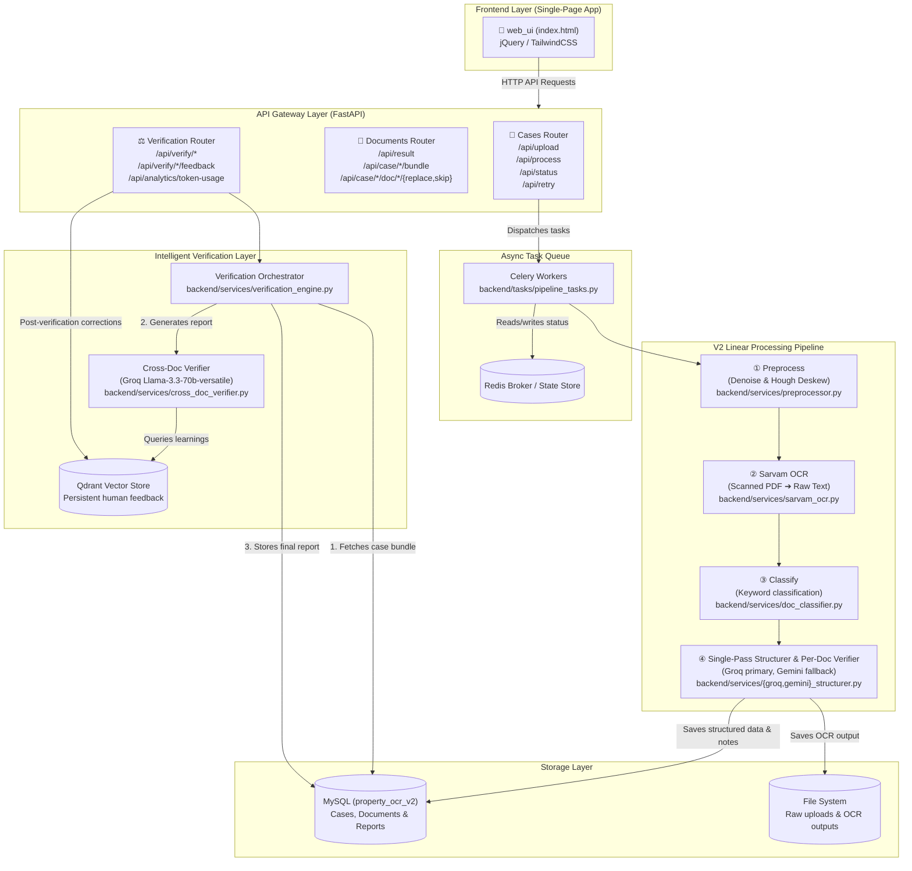

# Property OCR & Verification Pipeline

An end-to-end document processing and intelligent verification pipeline for Karnataka property documents. The system extracts structured JSON from scanned PDFs using Sarvam OCR, performs single-pass LLM structuring and per-document verification (Groq / Gemini), and executes a single-pass cross-document legal verification.

## 🏗️ V2 System Architecture



### Key Component Architecture

| Component | Technology | Description |
|---|---|---|
| **Frontend** | HTML5, Vanilla JS, CSS | Interactive single-page UI for case uploads, real-time pipeline status tracking, structured data viewing, and interactive verification reports. |
| **API Layer** | FastAPI, Uvicorn | High-performance async REST API routing case uploads, document actions, analytics, and verification triggers. |
| **Async Tasks** | Celery, Redis | Manages asynchronous background processing (preprocessing, OCR, classification, and structuring) in parallel for high throughput. |
| **OCR Service** | Sarvam AI Vision OCR | High-accuracy OCR for mixed English/Kannada text, including table structure extraction. |
| **Structuring** | Groq (Llama-3) / Gemini | Single-pass extraction of key fields into JSON schemas, while simultaneously generating per-document verification notes. |
| **Verification Engine** | Groq (Llama 3.3 70B) | Simple, linear orchestrator that pulls the structured case bundle and runs a single LLM call for cross-doc checks. |
| **Vector DB** | Qdrant (Persistent) | Stores human corrections to align the system and adjust verification rules on-the-fly. |
| **Relational Database** | MySQL (V2 Schema) | Unified database tables for cases, documents, cross-doc reports, and human feedback. |

---

## 📄 Supported Document Types

- **Ownership & Transfer**: `SALE_DEED`, `GIFT_DEED`, `PARTITION_DEED`
- **Government Registry**: `ENCUMBRANCE_CERTIFICATE` (EC), `PROPERTY_REGISTER_CARD` (PRC)
- **Municipal & Tax**: `KHATA`, `PROPERTY_TAX_ASSESSMENT`, `TAX_RECEIPT` / `E_PAYMENT_RECEIPT`
- **Revenues & Clearances**: `MUTATION`, `CONVERSION_ORDER`, `POSSESSION_CERTIFICATE`
- **Others**: `RTC_PAHANI`, `LEGAL_HEIR_CERTIFICATE`, `COURT_ORDER`

---

## 🛠️ Installation & Setup

### Prerequisites

- Python 3.10+
- MySQL 8.0+
- Redis Server

### 1. Database Setup
Ensure you have MySQL running, then create the V2 database:
```sql
CREATE DATABASE IF NOT EXISTS property_ocr_v2 CHARACTER SET utf8mb4 COLLATE utf8mb4_unicode_ci;
```

### 2. Environment Configuration
Create a `.env` file in the root directory:
```env
# API Keys
SARVAM_API_KEY=your_sarvam_api_key
GROQ_API_KEY=your_groq_api_key
GEMINI_API_KEY=your_gemini_api_key

# MySQL V2 Configuration
MYSQL_HOST=127.0.0.1
MYSQL_PORT=3306
MYSQL_USER=root
MYSQL_PASSWORD=your_mysql_password
MYSQL_DATABASE_V2=property_ocr_v2

# Redis configuration
REDIS_URL=redis://localhost:6379/0

# Optional Model Overrides
GEMINI_MODEL=gemini-2.5-flash
```

### 3. Install Dependencies
```bash
pip install -r requirements.txt
```

---

## 🚀 Running the Application

For local development, run the following commands in separate terminal sessions:

1. **Redis Server:**
   ```powershell
   & "$env:TEMP\redis\redis-server.exe"
   ```

2. **Celery Worker:**
   ```powershell
   .\venv\Scripts\celery.exe -A backend.celery_app worker --loglevel=info --pool=solo --concurrency=1
   ```

3. **FastAPI Backend (Uvicorn):**
   ```powershell
   .\venv\Scripts\uvicorn.exe backend.main:app --reload --port 8000
   ```

The frontend can be accessed by opening `frontend/index.html` in your browser.

---

## 🔌 API Endpoints

### Pipeline & Cases
* **`POST /api/upload`**: Upload documents and initialize a case.
* **`POST /api/process/{case_id}`**: Trigger async OCR and structuring pipeline.
* **`GET /api/status/{case_id}`**: Retrieve real-time case processing status.
* **`POST /api/retry/{case_id}`**: Retry processing for failed documents.

### Documents & Structured Data
* **`GET /api/case/{case_id}/bundle`**: Get all processed documents in a case.
* **`GET /api/result/{case_id}/{doc_id}`**: Retrieve OCR text and structured JSON for a document.
* **`POST /api/case/{case_id}/doc/{doc_id}/replace`**: Replace a document file.
* **`POST /api/case/{case_id}/doc/{doc_id}/skip`**: Mark a document to be skipped.

### Intelligent Verification & Analytics
* **`POST /api/verify/{case_id}`**: Execute cross-document verification checks.
* **`GET /api/verify/{case_id}/report`**: Retrieve the latest cross-document verification report.
* **`GET /api/verify/{case_id}/per-doc`**: Retrieve per-document verification notes.
* **`POST /api/verify/{case_id}/feedback`**: Submit human feedback (stored in Qdrant).
* **`GET /api/analytics/token-usage`**: Fetch per-case token, latency, and cost stats.

---

## 📂 Project Structure

```
property_ocr/
│
├── backend/
│   ├── main.py                    # FastAPI entrypoint
│   ├── celery_app.py              # Celery configuration
│   ├── logger.py                  # Logger utility
│   │
│   ├── routers/
│   │   ├── cases.py               # Pipeline & upload handlers
│   │   ├── documents.py           # Document retrieval & edits
│   │   └── verification.py        # Verification & analytics endpoints
│   │
│   ├── services/
│   │   ├── pipeline_orchestrator.py   # Celery task coordination
│   │   ├── preprocessor.py            # Image enhancement & deskewing
│   │   ├── sarvam_ocr.py              # Sarvam AI OCR client
│   │   ├── ocr_merger.py              # OCR chunk consolidation
│   │   ├── doc_classifier.py          # Document type classifier
│   │   ├── groq_structurer.py         # Primary Groq JSON structurer
│   │   ├── gemini_structurer.py       # Fallback Gemini JSON structurer
│   │   ├── cross_doc_verifier.py      # Groq cross-document checker
│   │   ├── verification_engine.py     # Verification orchestrator
│   │   ├── vector_store.py            # Qdrant learning repository
│   │   ├── mysql_store_v2.py          # MySQL V2 store wrapper
│   │   └── mysql_store.py             # MySQL V1 backward compatibility store
│   │
│   └── tasks/
│       └── pipeline_tasks.py      # Celery task executors
│
├── frontend/                      # Web interface files
│   ├── index.html                 # Single-page dashboard
│   └── js/
│       ├── api.js                 # API call handlers
│       ├── app.js                 # App event bindings
│       ├── history.js             # Historical cases view
│       └── ui.js                  # Dynamic rendering methods
│
├── requirements.txt               # App dependencies list
└── README.md                      # System manual
```
