# Property OCR Pipeline

End-to-end document processing pipeline for Karnataka property documents. Extracts structured data from scanned PDFs using Sarvam OCR, LLM-based structuring (Groq + Gemini), and an agentic verification engine (LangGraph + Gemini).

## Architecture

### Layered System Overview

```mermaid
flowchart TB
    subgraph Frontend["Frontend Layer"]
        UI["📄 Single-Page HTML<br/>index.html"]
    end

    subgraph API["API Layer (FastAPI)"]
        R_CASES["/api/upload<br/>/api/process<br/>/api/status<br/>/api/retry<br/>/api/clear"]
        R_DOCS["/api/result<br/>/api/case/*/doc/*/replace<br/>/api/case/*/doc/*/skip<br/>/api/case/*/bundle"]
        R_VERIFY["/api/verify/*<br/>/api/verify/*/feedback<br/>/api/verify/*/report<br/>/api/verify/learnings/stats<br/>/api/verify/training-data"]
    end

    subgraph Orchestration["Orchestration Layer"]
        CELERY["Celery Worker<br/>backend/tasks/pipeline_tasks.py"]
        REDIS_BROKER[(Redis<br/>Message Broker)]
        ORCHESTRATOR["Pipeline Orchestrator<br/>backend/services/pipeline_orchestrator.py"]
    end

    subgraph Pipeline["Document Processing Pipeline"]
        PREPROC["① Preprocess<br/>contrast / denoise / deskew<br/>backend/services/preprocessor.py"]
        OCR["② Sarvam OCR<br/>chunked page processing<br/>with 3× retry<br/>backend/services/sarvam_ocr.py"]
        MERGE["③ Merge Chunks<br/>combine OCR results<br/>backend/services/ocr_merger.py"]
        CLASSIFY["④ Classify<br/>keyword matching<br/>EN + Kannada<br/>backend/services/doc_classifier.py"]
        STRUCTURE["⑤ Structure"]
        GROQ["Groq LLM<br/>(primary, cheaper)"]
        GEMINI_STRUCT["Gemini LLM<br/>(fallback with retry)"]
        EC_PARSER["EC Parser<br/>(deterministic)"]
        PTA_PARSER["Property Tax Parser<br/>(deterministic)"]
    end

    subgraph Verification["Agentic Verification Layer"]
        LANGGRAPH["LangGraph State Machine<br/>backend/services/verification_engine.py"]
        GEMINI_AGENT["Gemini Agent<br/>Senior Verification Officer"]
        TOOLS["Deterministic Tools<br/>backend/services/verification_tools.py"]
        VECTOR_DB[("Qdrant<br/>Vector Store<br/>past learnings")]
        TOOL_SALE["verify_sale_deed()"]
        TOOL_GIFT["verify_gift_deed()"]
        TOOL_EC["verify_encumbrance_certificate()"]
        TOOL_PRC["verify_property_register_card()"]
        TOOL_TAX["verify_tax_receipt()"]
        TOOL_PROP["verify_property_identity()"]
        TOOL_OWNER["verify_ownership_chain()"]
        TOOL_REDFLAG["check_red_flags()"]
    end

    subgraph Storage["Storage Layer"]
        MYSQL[("MySQL<br/>cases / documents<br/>verification reports<br/>training data")]
        REDIS_STATE[("Redis<br/>pipeline state<br/>status / results / errors")]
        FS[("File System<br/>raw PDFs / preprocessed<br/>OCR chunks / structured JSON")]
    end

    subgraph External["External APIs"]
        SARVAM_API["Sarvam API<br/>Vision OCR"]
        GROQ_API["Groq API<br/>LLM Structuring"]
        GEMINI_API["Gemini API<br/>Structuring + Verification"]
    end

    %% ── Frontend → API ──
    UI -->|"HTTP /fetch"| R_CASES
    UI -->|"HTTP /fetch"| R_DOCS
    UI -->|"HTTP /fetch"| R_VERIFY

    %% ── API → Orchestration ──
    R_CASES -->|"triggers chord"| ORCHESTRATOR
    ORCHESTRATOR -->|"sends tasks"| REDIS_BROKER
    REDIS_BROKER -->|"delivers"| CELERY
    CELERY -->|"result"| REDIS_BROKER
    ORCHESTRATOR -->|"finalize callback"| CELERY

    %% ── Pipeline flow ──
    CELERY -->|"per-document task"| PREPROC
    PREPROC -->|"enhanced PDF"| OCR
    OCR -->|"chunk results"| MERGE
    MERGE -->|"merged text"| CLASSIFY
    CLASSIFY -->|"doc_type"| STRUCTURE

    %% ── Structure branching ──
    STRUCTURE -->|"EC"| EC_PARSER
    STRUCTURE -->|"Property Tax"| PTA_PARSER
    STRUCTURE -->|"all others"| GROQ
    GROQ -->|"on failure"| GEMINI_STRUCT

    %% ── External API calls ──
    OCR -->|"HTTP"| SARVAM_API
    GROQ -->|"HTTP"| GROQ_API
    GEMINI_STRUCT -->|"HTTP"| GEMINI_API

    %% ── Storage writes ──
    PREPROC -->|"saves"| FS
    OCR -->|"saves"| FS
    MERGE -->|"saves"| FS
    STRUCTURE -->|"saves structured JSON"| FS
    STRUCTURE -->|"writes"| MYSQL
    CELERY -->|"writes status/progress"| REDIS_STATE

    %% ── API → Storage reads ──
    R_CASES -.->|"reads"| REDIS_STATE
    R_DOCS -.->|"reads"| MYSQL
    R_DOCS -.->|"reads"| FS

    %% ── Verification flow ──
    R_VERIFY -->|"POST /verify"| LANGGRAPH
    LANGGRAPH -->|"invokes"| GEMINI_AGENT
    GEMINI_AGENT -->|"calls tools"| TOOLS
    TOOLS -->|"verify_sale_deed"| TOOL_SALE
    TOOLS -->|"verify_gift_deed"| TOOL_GIFT
    TOOLS -->|"verify_encumbrance_certificate"| TOOL_EC
    TOOLS -->|"verify_property_register_card"| TOOL_PRC
    TOOLS -->|"verify_tax_receipt"| TOOL_TAX
    TOOLS -->|"verify_property_identity"| TOOL_PROP
    TOOLS -->|"verify_ownership_chain"| TOOL_OWNER
    TOOLS -->|"check_red_flags"| TOOL_REDFLAG
    GEMINI_AGENT -->|"queries"| VECTOR_DB
    LANGGRAPH -->|"saves report"| MYSQL
    LANGGRAPH -->|"saves training record"| MYSQL

    %% ── Human feedback loop ──
    R_VERIFY -->|"POST /feedback"| VECTOR_DB
    VECTOR_DB -.->|"learns for next run"| LANGGRAPH

    %% ── Styling ──
    classDef api fill:#2563eb,color:#fff,stroke:none;
    classDef pipeline fill:#16a34a,color:#fff,stroke:none;
    classDef storage fill:#6b7280,color:#fff,stroke:none;
    classDef external fill:#9333ea,color:#fff,stroke:none;
    classDef verify fill:#d97706,color:#fff,stroke:none;
    classDef frontend fill:#1e3a5f,color:#fff,stroke:none;
    classDef tool fill:#fef3c7,color:#92400e,stroke:#d97706;

    class R_CASES,R_DOCS,R_VERIFY api;
    class PREPROC,OCR,MERGE,CLASSIFY,GROQ,GEMINI_STRUCT,EC_PARSER,PTA_PARSER pipeline;
    class FS,MYSQL,REDIS_STATE storage;
    class SARVAM_API,GROQ_API,GEMINI_API external;
    class LANGGRAPH,GEMINI_AGENT,TOOLS verify;
    class UI frontend;
    class TOOL_SALE,TOOL_GIFT,TOOL_EC,TOOL_PRC,TOOL_TAX,TOOL_PROP,TOOL_OWNER,TOOL_REDFLAG tool;
```



### Component Roles

| Layer | Component | Role |
|---|---|---|
| **API** | FastAPI Routers | HTTP endpoints for upload, pipeline control, document CRUD, verification |
| **Orchestration** | Celery + Redis Broker | Distributed task queue — parallel per-document processing with chord callback |
| **Pipeline** | Preprocessor | CLAHE contrast enhancement, NL-means denoising, Hough deskew, Otsu binarization |
| **Pipeline** | Sarvam OCR | Vision-based OCR with automatic page chunking and 3× retry |
| **Pipeline** | OCR Merger | Reassembles chunked OCR outputs into unified page text |
| **Pipeline** | Doc Classifier | Keyword matching (English + Kannada) on filename and text sample |
| **Pipeline** | Groq / Gemini | LLM-based structuring of raw OCR → structured JSON (Groq primary, Gemini fallback) |
| **Pipeline** | EC / Tax Parsers | Deterministic parsers for Encumbrance Certificate and Property Tax tables |
| **Storage** | MySQL | Persistent store: cases, documents, verification reports, training data |
| **Storage** | Redis | Ephemeral pipeline state: status, progress, results, errors, logs |
| **Storage** | File System | Raw PDFs, preprocessed copies, OCR chunks, structured JSON output |
| **Verification** | LangGraph | State machine orchestrating AI agent tool calls |
| **Verification** | Gemini Agent | "Senior Verification Officer" — decides which checks to run |
| **Verification** | Deterministic Tools | 8 Python functions for deed/EC/tax/receipt verification + cross-checks |
| **Verification** | Qdrant | In-memory vector store for human feedback corrections (learning loop) |

## Document Types

- SALE_DEED, GIFT_DEED, ENCUMBRANCE_CERTIFICATE
- RTC_PAHANI, KHATA, MUTATION
- PROPERTY_REGISTER_CARD, PROPERTY_TAX_ASSESSMENT
- E_PAYMENT_RECEIPT, TAX_RECEIPT
- LEGAL_HEIR_CERTIFICATE, PARTITION_DEED
- COURT_ORDER, POSSESSION_CERTIFICATE, CONVERSION_ORDER

## Prerequisites

- Python 3.10+
- MySQL 8.0+
- Redis 7+
- API keys: [Sarvam](https://sarvam.ai), [Groq](https://groq.com), [Gemini](https://ai.google.dev)

## Setup

```bash
# Clone and install
pip install -r requirements.txt

# Environment variables
cp .env.example .env
# Edit .env with your API keys and database credentials

# Start services (or use Docker)
mysql -u root -e "CREATE DATABASE IF NOT EXISTS property_ocr"
redis-server

# Run API server
uvicorn backend.main:app --reload --port 8000

# Run Celery worker (separate terminal)
celery -A backend.celery_app worker --loglevel=info --concurrency=4
```

## Environment Variables

| Variable | Default | Required |
|---|---|---|
| `SARVAM_API_KEY` | — | Yes |
| `GROQ_API_KEY` | — | Yes |
| `GEMINI_API_KEY` | — | Yes (verification) |
| `MYSQL_HOST` | 127.0.0.1 | No |
| `MYSQL_PORT` | 3306 | No |
| `MYSQL_USER` | root | No |
| `MYSQL_PASSWORD` | (set in .env) | Yes |
| `MYSQL_DATABASE` | property_ocr | No |
| `REDIS_URL` | redis://localhost:6379/0 | No |
| `GEMINI_MODEL` | gemini-2.5-flash | No |

## API Endpoints

### Pipeline
| Method | Path | Description |
|---|---|---|
| POST | `/api/upload` | Upload PDF documents |
| POST | `/api/process/{case_id}` | Start OCR pipeline |
| GET | `/api/status/{case_id}` | Get pipeline status |
| POST | `/api/retry/{case_id}` | Retry failed documents |
| POST | `/api/clear` | Clear all Redis data |

### Documents
| Method | Path | Description |
|---|---|---|
| GET | `/api/result/{case_id}/{doc_id}` | Get structured result |
| GET | `/api/case/{case_id}/bundle` | Get all structured docs |
| POST | `/api/case/{case_id}/doc/{doc_id}/replace` | Replace a document |
| POST | `/api/case/{case_id}/doc/{doc_id}/skip` | Skip a document |

### Verification
| Method | Path | Description |
|---|---|---|
| POST | `/api/verify/{case_id}` | Run agentic verification |
| GET | `/api/verify/{case_id}/report` | Get verification report |
| POST | `/api/verify/{case_id}/feedback` | Submit human feedback |
| GET | `/api/verify/learnings/stats` | Vector DB stats |
| GET | `/api/verify/training-data` | List training records |

## Project Structure

```
backend/
├── main.py                    # FastAPI app entry point
├── celery_app.py              # Celery config
├── logger.py                  # Logging configuration
├── routers/
│   ├── cases.py               # Upload, process, status, retry
│   ├── documents.py           # Replace, skip, result
│   └── verification.py        # Verify, feedback, training data
├── services/
│   ├── pipeline_orchestrator.py   # Celery chord orchestration
│   ├── preprocessor.py            # PDF image enhancement
│   ├── sarvam_ocr.py              # Sarvam OCR integration
│   ├── ocr_merger.py              # Chunk merging
│   ├── doc_classifier.py          # Keyword-based classification
│   ├── groq_structurer.py         # Groq LLM structuring
│   ├── gemini_structurer.py       # Gemini LLM structuring
│   ├── ec_parser.py               # Deterministic EC parser
│   ├── property_tax_assessment_parser.py
│   ├── mysql_store.py             # MySQL persistence
│   ├── redis_store.py             # Redis state store
│   ├── verification_engine.py     # LangGraph verification
│   ├── verification_tools.py      # Deterministic check tools
│   └── vector_store.py            # Qdrant vector store
├── tasks/
│   └── pipeline_tasks.py      # Celery task definitions
└── utils/
    └── file_utils.py           # File I/O helpers
frontend/
└── index.html                  # Single-page UI
```
