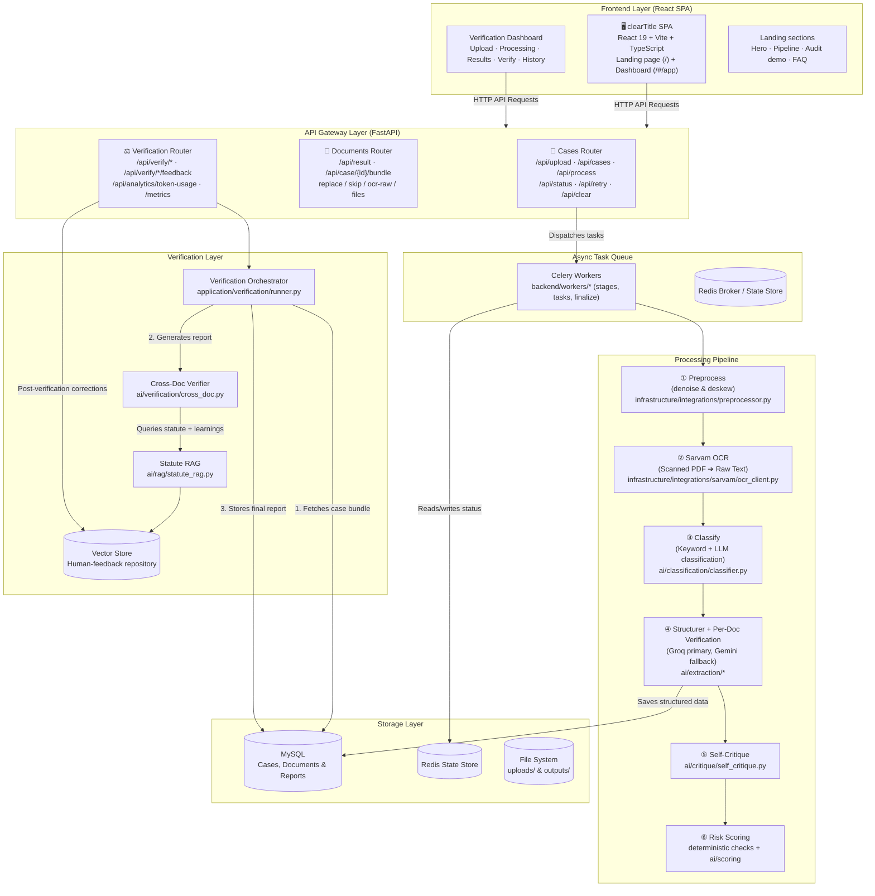

# clearTitle — AI Property Title Verification

An end-to-end property title verification platform for **Karnataka property documents**. clearTitle extracts structured JSON from scanned PDFs (Sarvam Vision OCR), runs single-pass LLM structuring and per-document verification (Groq / Gemini), executes cross-document legal verification with deterministic risk checks, and presents everything in a warm, premium dashboard — with a landing page that explains the product.

---

## 🏗️ System Architecture



### Key Components

| Component | Technology | Description |
|---|---|---|
| **Frontend** | React 19, Vite 6, TypeScript, Tailwind CSS 4 | Landing page + admin dashboard with upload pipeline, results, verification report, and case history |
| **API Layer** | FastAPI, Uvicorn | Async REST API for cases, documents, analytics, and verification |
| **Async Tasks** | Celery, Redis | Idempotent background stages — preprocess, OCR, classify, structure, critique, score, finalize |
| **OCR Service** | Sarvam AI Vision OCR | High-accuracy OCR for mixed English/Kannada text with table extraction |
| **Structuring** | Groq (Llama-3) / Gemini | Single-pass JSON field extraction with per-document verification notes |
| **Verification** | Groq Llama-3.3-70B + deterministic checks | Cross-document legal checks, self-critique, and risk scoring |
| **RAG / Learnings** | Qdrant (local file mode) | Statute retrieval and persistent human-feedback corrections |
| **Relational DB** | MySQL | Unified tables for cases, documents, verification reports, and feedback |

---

## 🧠 Verification Features

- **Per-Document Checks** — Stamp duty ratios, witness counts, GPA authorizations, and date ordering verified inside LLM prompts; deterministic checks run alongside (see `ai/verification/deterministic/checks.py`).
- **Self-Critique** — Every structured result passes through a critique stage before scoring.
- **Human Feedback Loop** — Corrections from the Human Review tab are stored and queried during future verifications.
- **Risk Scoring** — Critical / High / Medium / Low findings plus a 0–100 risk score and final legal opinion.
- **PDF Export** — Client-side report export (jsPDF) for every verification case.

---

## 📄 Supported Document Types

| Category | Types |
|---|---|
| **Ownership & Transfer** | `SALE_DEED`, `GIFT_DEED`, `PARTITION_DEED` |
| **Government Registry** | `ENCUMBRANCE_CERTIFICATE` (EC), `PROPERTY_REGISTER_CARD` (PRC) |
| **Municipal & Tax** | `KHATA`, `PROPERTY_TAX_ASSESSMENT`, `TAX_RECEIPT`, `E_PAYMENT_RECEIPT` |
| **Revenue & Clearances** | `MUTATION`, `CONVERSION_ORDER`, `POSSESSION_CERTIFICATE` |
| **Legal & Others** | `RTC_PAHANI`, `LEGAL_HEIR_CERTIFICATE`, `COURT_ORDER` |

---

## 🚀 Quick Start (Docker — Recommended)

> **Only requirement:** [Docker Desktop](https://www.docker.com/products/docker-desktop/) installed. No Python, MySQL, or Redis needed on your machine.

### 1. Clone and configure

```bash
git clone <repo-url>
cd cleartitle
cp .env.example .env
```

Open `.env` and fill in the API keys (everything else works as-is):

```env
SARVAM_API_KEY=your_key_here
GROQ_API_KEY=your_key_here
GEMINI_API_KEY=your_key_here
```

### 2. Start everything

```bash
docker compose up --build
```

This starts 5 services automatically:

| Service | URL / Port | Purpose |
|---|---|---|
| **App (FastAPI + React SPA)** | http://localhost:8000 | Main application — open `/#/app` for the dashboard |
| **phpMyAdmin** | http://localhost:8080 | Browse MySQL data in browser |
| **MySQL** | `127.0.0.1:3307` | Database (exposed for GUI tools) |
| **Redis** | internal only | Celery broker + state store |
| **Celery Worker** | internal only | Background task processing (`--concurrency=2`) |

> On subsequent runs just use `docker compose up`. Rebuild with `docker compose up --build` after changing code — the React SPA is baked into the image.

---

## 🖥️ Frontend Development (Without Docker)

The React app lives in `frontend/`. It has its own dev server (Express + Vite HMR) on port 3000:

```bash
cd frontend
npm install
cp .env.example .env   # optional: AI_API_KEY for the /api/verify-property mock demo
npm run dev            # http://localhost:3000
```

| Command | Description |
|---|---|
| `npm run dev` | Dev server (Express + Vite middleware) on :3000 |
| `npm run build` | Build the Vite frontend + bundle the server to `dist/` |
| `npm run lint` | Type-check with `tsc --noEmit` |
| `npm start` | Run the production server from `dist/` |

When deployed via Docker, the built SPA is served by FastAPI from `frontend/dist`.

---

## 🗄️ Inspecting the Database

### Option A — phpMyAdmin (browser, zero install)

Open **http://localhost:8080** — you'll see all tables (`cases`, `documents`, `verifications`, etc.) and can browse/query data directly.

### Option B — MySQL Workbench / DBeaver / TablePlus

```
Host:     127.0.0.1
Port:     3307          ← not 3306, to avoid conflict with any local MySQL
User:     property_user
Password: property_pass_123
Database: property_ocr_v2
```

### Option C — Terminal (no GUI needed)

```bash
docker compose exec mysql mysql -u property_user -pproperty_pass_123 property_ocr_v2
```

---

## 🔌 API Endpoints

### Pipeline & Cases
| Method | Endpoint | Description |
|---|---|---|
| `GET` | `/api/cases` | List cases (MySQL + filesystem fallback) |
| `POST` | `/api/upload` | Upload PDFs and initialize a new case |
| `POST` | `/api/process/{case_id}` | Trigger the async OCR + structuring pipeline |
| `GET` | `/api/status/{case_id}` | Real-time pipeline status |
| `POST` | `/api/retry/{case_id}` | Retry failed documents |
| `POST` | `/api/case/{case_id}/upload` | Add more documents to an existing case |
| `POST` | `/api/clear` | Wipe all cases |
| `DELETE` | `/api/case/{case_id}` | Delete a single case (Redis + MySQL + files) |

### Documents & Structured Data
| Method | Endpoint | Description |
|---|---|---|
| `GET` | `/api/case/{case_id}/bundle` | All processed documents in a case |
| `GET` | `/api/result/{case_id}/{doc_id}` | OCR text + structured JSON for one document |
| `GET` | `/api/case/{case_id}/ocr-raw` | List merged OCR files for a case |
| `GET` | `/api/case/{case_id}/doc/{doc_id}/ocr-raw` | Full OCR text for a specific document |
| `GET` | `/api/case/{case_id}/files` | File-tree listing for a case |
| `GET` | `/api/case/{case_id}/documents` | Document rows for a case |
| `POST` | `/api/case/{case_id}/doc/{doc_id}/replace` | Replace a document file |
| `POST` | `/api/case/{case_id}/doc/{doc_id}/skip` | Mark a document as skipped |

### Verification & Analytics
| Method | Endpoint | Description |
|---|---|---|
| `POST` | `/api/verify/{case_id}` | Run cross-document verification |
| `GET` | `/api/verify/{case_id}/report` | Latest verification report (full enriched payload) |
| `GET` | `/api/verify/{case_id}/per-doc` | Per-document verification notes |
| `POST` | `/api/verify/{case_id}/feedback` | Submit human feedback (stored in vector store) |
| `GET` | `/api/verify/learnings/stats` | Count of stored learnings |
| `GET` | `/api/analytics/token-usage` | Per-case token, latency, and cost stats |
| `GET` | `/api/analytics/cost-dashboard` | Cost dashboard data |
| `GET` | `/api/analytics/quota-tracking` | API quota tracking |
| `GET` | `/health` | Health check |
| `GET` | `/metrics` | Prometheus metrics |

---

## 📂 Project Structure

```
cleartitle/
│
├── backend/                        # FastAPI + Celery
│   ├── main.py                     # FastAPI entrypoint (serves API + React SPA)
│   ├── celery_app.py               # Celery configuration
│   ├── logger.py                   # Logging utility
│   │
│   ├── routers/                    # HTTP layer
│   │   ├── cases.py                # Upload, process, status, retry, delete
│   │   ├── documents.py            # Result, bundle, OCR raw, replace/skip
│   │   └── verification.py         # Verification, feedback & analytics
│   │
│   ├── application/                # Use-case orchestration
│   │   ├── pipeline/               # orchestrator, state machine, context
│   │   └── verification/           # runner, reporting, feedback
│   │
│   ├── workers/                    # Celery task executors
│   │   ├── stages.py               # Individual pipeline stage tasks
│   │   ├── tasks.py                # Task declarations
│   │   ├── stage_adapter.py        # Stage context builder
│   │   ├── idempotency.py          # Idempotency guards
│   │   └── finalize.py             # Case finalization
│   │
│   ├── ai/                         # AI capabilities
│   │   ├── classification/         # Document type classifier
│   │   ├── extraction/             # Groq / Gemini structurers
│   │   ├── verification/           # Cross-doc verifier + deterministic checks
│   │   ├── critique/               # Self-critique pass
│   │   ├── scoring/                # Risk scoring
│   │   ├── rag/                    # Statute RAG + vector store
│   │   └── prompts/                # Prompt templates & schemas
│   │
│   ├── infrastructure/             # Framework adapters
│   │   ├── integrations/           # Sarvam OCR, Gemini, model router, preprocessor
│   │   ├── database/               # Connection, migrations, repositories
│   │   ├── cache/                  # Redis state store, rate limiter
│   │   ├── storage/                # File service & utils
│   │   └── locking/                # Redis locks
│   │
│   ├── observability/              # Logging, metrics, tracing
│   ├── domain/                     # State machine domain model
│   ├── shared/                     # Constants & helpers
│   └── app/                        # App configuration
│
├── frontend/                       # React SPA (Vite)
│   ├── src/
│   │   ├── components/             # Landing-page sections (Navbar, Hero, FAQ, ...)
│   │   ├── dashboard/              # Verification dashboard (upload, report, history)
│   │   ├── api/backend.ts          # API client
│   │   ├── data/                   # Landing content
│   │   ├── App.tsx                 # Route: homepage / + dashboard /#/app
│   │   ├── index.css               # Tailwind theme + brand fonts
│   │   └── main.tsx
│   ├── public/                     # Favicon, static assets
│   ├── server.ts                   # Dev server (Express + Vite middleware)
│   └── index.html
│
├── uploads/                        # Uploaded PDF storage (bind-mounted)
├── outputs/                        # OCR + structured outputs (bind-mounted)
├── data/                           # Qdrant vector DB (bind-mounted)
├── docker-compose.yml
├── Dockerfile
└── requirements.txt
```

---

## 🎨 UI Design System

The frontend follows a warm, editorial design system shared by the landing page and dashboard:

- **Palette** — Cream background (`#FFF8F2`), warm stone neutrals, and an orange brand scale (`#ea580c`, `#f97316`, amber `#fbbf24`). Semantic status colors (emerald / amber / rose) preserved for verification results.
- **Typography** — Inter (body), Plus Jakarta Sans (display/headings), Instrument Serif (accent italics). Loaded once from Google Fonts in `frontend/index.html`.
- **Icons** — lucide-react (no emoji).
- **Dashboard** (`/#/app`) — Custom CSS (`dashboard.css`) with CSS-token theming: cards, badges, metric tiles, log viewers, evidence drawers, property sheets, finding rows, and PDF export.

---

## 🛠️ Manual Setup (Backend, Without Docker)

<details>
<summary>Click to expand — for local backend development without Docker</summary>

**Prerequisites:** Python 3.11+, MySQL 8.0, Redis

### Step 1 — Create the database

```sql
CREATE DATABASE IF NOT EXISTS property_ocr_v2
  CHARACTER SET utf8mb4 COLLATE utf8mb4_unicode_ci;
```

### Step 2 — Configure environment

```bash
# Windows
copy .env.example .env

# Linux / macOS
cp .env.example .env
```

Update these values to match your local MySQL:

```env
MYSQL_HOST=127.0.0.1
MYSQL_PORT=3306
MYSQL_USER=root
MYSQL_PASSWORD=your_mysql_password
MYSQL_DATABASE=property_ocr_v2
REDIS_URL=redis://localhost:6379/0
```

### Step 3 — Install dependencies

```bash
python -m venv venv
# Windows:  .\venv\Scripts\Activate.ps1
# Linux/macOS: source venv/bin/activate
pip install -r requirements.txt
```

### Step 4 — Run the application (3 terminals)

**Terminal 1 — Redis:** `redis-server`

**Terminal 2 — Celery Worker:**

Windows:
```powershell
.\venv\Scripts\celery.exe -A backend.celery_app worker --loglevel=info --pool=solo --concurrency=1
```
Linux / macOS:
```bash
celery -A backend.celery_app worker --loglevel=info --concurrency=2
```

**Terminal 3 — FastAPI Server:**

Windows:
```powershell
.\venv\Scripts\uvicorn.exe backend.main:app --reload --port 8000
```
Linux / macOS:
```bash
uvicorn backend.main:app --reload --port 8000
```

Open **http://localhost:8000** in your browser.

</details>

---

*Last updated: 3 August 2026*
