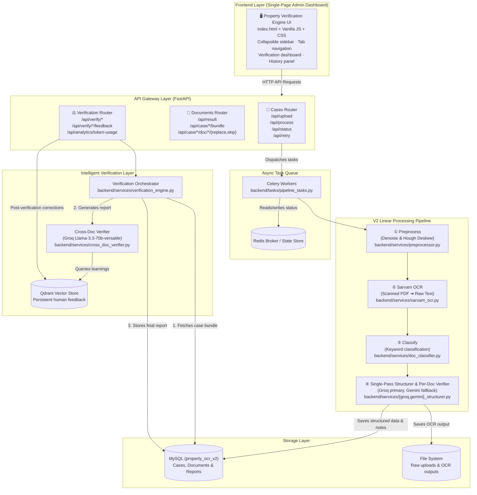

# Property Verification Engine

An end-to-end document processing and intelligent legal verification platform for Karnataka property documents. The system extracts structured JSON from scanned PDFs using Sarvam OCR, performs single-pass LLM structuring and per-document verification (Groq / Gemini), executes cross-document legal verification, and presents findings in a premium enterprise-grade admin dashboard UI.

---

## 🏗️ System Architecture



### Key Components

| Component | Technology | Description |
|---|---|---|
| **Frontend UI** | HTML5, Vanilla JS, CSS | Premium admin dashboard — collapsible sidebar, tab navigation, verification report panels, historical case viewer, grouped field summary property sheet |
| **API Layer** | FastAPI, Uvicorn | Async REST API for case uploads, document actions, analytics, and verification triggers |
| **Async Tasks** | Celery, Redis | Background processing — preprocessing, OCR, classification, and structuring in parallel |
| **OCR Service** | Sarvam AI Vision OCR | High-accuracy OCR for mixed English/Kannada text including table structure extraction |
| **Structuring** | Groq (Llama-3) / Gemini | Single-pass JSON field extraction with simultaneous per-document verification notes |
| **Verification Engine** | Groq (Llama 3.3 70B) | Cross-document legal checker — owner consistency, stamp duty, area, registration date checks |
| **Vector DB** | Qdrant (Persistent) | Stores human corrections to align the system and adjust verification rules on-the-fly |
| **Relational DB** | MySQL (V2 Schema) | Unified tables for cases, documents, cross-doc reports, and human feedback |

---


## 🧠 Intelligent Verification Features

- **100% LLM-Based Per-Document Checks** — Stamp duty ratios, witness counts, GPA authorizations, and date ordering are verified entirely within LLM prompts. Computations (e.g. `168000 / 2500000 × 100 = 6.72%`) appear verbatim in the `evidence` field for full transparency.
- **Context Cache Auto-Invalidation** — Static instructions and schemas are cached. An MD5 checksum of prompt contents triggers automatic cache invalidation/rebuild on Gemini's servers when rules change.
- **Human Feedback Loop** — Post-verification corrections are stored in Qdrant and queried during future verifications to continuously improve accuracy.
- **Rich Historical Report Enrichment** — The `GET /api/verify/{case_id}/report` endpoint dynamically formats stored findings into the full dashboard payload (metrics, risk scores, per-doc findings, missing docs) — identical to the live pipeline output.

---

## 📄 Supported Document Types

| Category | Types |
|---|---|
| **Ownership & Transfer** | `SALE_DEED`, `GIFT_DEED`, `PARTITION_DEED` |
| **Government Registry** | `ENCUMBRANCE_CERTIFICATE` (EC), `PROPERTY_REGISTER_CARD` (PRC) |
| **Municipal & Tax** | `KHATA`, `PROPERTY_TAX_ASSESSMENT`, `TAX_RECEIPT`, `E_PAYMENT_RECEIPT` |
| **Revenue & Clearances** | `MUTATION`, `CONVERSION_ORDER`, `POSSESSION_CERTIFICATE` |
| **Legal & Others** | `RTC_PAHANI`, `LEGAL_HEIR_CERTIFICATE`, `COURT_ORDER` |

---

## 🛠️ Installation & Setup

### Prerequisites

- Python 3.10+
- MySQL 8.0+
- Redis Server

### 1. Database Setup

```sql
CREATE DATABASE IF NOT EXISTS property_ocr_v2 CHARACTER SET utf8mb4 COLLATE utf8mb4_unicode_ci;
```

### 2. Environment Configuration

Create a `.env` file in the root directory:

```env
# API Keys
SARVAM_API_KEY=your_sarvam_api_key
GROQ_API_KEY=your_groq_api_key
GEMINI_API_KEY=your_gemini_api_key

# MySQL V2 Configuration
MYSQL_HOST=127.0.0.1
MYSQL_PORT=3306
MYSQL_USER=root
MYSQL_PASSWORD=your_mysql_password
MYSQL_DATABASE_V2=property_ocr_v2

# Redis
REDIS_URL=redis://localhost:6379/0

# Optional Model Overrides
GEMINI_MODEL=gemini-2.5-flash
```

### 3. Install Dependencies

```bash
pip install -r requirements.txt
```

---

## 🚀 Running the Application

Run the following in **three separate terminal sessions**:

**1. Redis Server:**
```powershell
& "$env:TEMP\redis\redis-server.exe"
```

**2. Celery Worker:**
```powershell
.\venv\Scripts\celery.exe -A backend.celery_app worker --loglevel=info --pool=solo --concurrency=1
```

**3. FastAPI + Frontend (Uvicorn):**
```powershell
.\venv\Scripts\uvicorn.exe backend.main:app --reload --port 8000
```

Open **http://localhost:8000** in your browser. The frontend is served as static files by FastAPI.

---

## 🔌 API Endpoints

### Pipeline & Cases
| Method | Endpoint | Description |
|---|---|---|
| `POST` | `/api/upload` | Upload PDFs and initialize a new case |
| `POST` | `/api/process/{case_id}` | Trigger async OCR + structuring pipeline |
| `GET` | `/api/status/{case_id}` | Real-time pipeline status |
| `POST` | `/api/retry/{case_id}` | Retry failed documents |

### Documents & Structured Data
| Method | Endpoint | Description |
|---|---|---|
| `GET` | `/api/case/{case_id}/bundle` | All processed documents in a case |
| `GET` | `/api/result/{case_id}/{doc_id}` | OCR text + structured JSON for one document |
| `GET` | `/api/case/{case_id}/ocr-raw` | List merged OCR files for a case |
| `GET` | `/api/case/{case_id}/doc/{doc_id}/ocr-raw` | Full OCR text for a specific document |
| `POST` | `/api/case/{case_id}/doc/{doc_id}/replace` | Replace a document file |
| `POST` | `/api/case/{case_id}/doc/{doc_id}/skip` | Mark a document as skipped |

### Verification & Analytics
| Method | Endpoint | Description |
|---|---|---|
| `POST` | `/api/verify/{case_id}` | Run cross-document verification |
| `GET` | `/api/verify/{case_id}/report` | Latest verification report (full enriched payload) |
| `GET` | `/api/verify/{case_id}/per-doc` | Per-document verification notes |
| `POST` | `/api/verify/{case_id}/feedback` | Submit human feedback (stored in Qdrant) |
| `GET` | `/api/analytics/token-usage` | Per-case token, latency, and cost stats |

---

## 📂 Project Structure

```
property_ocr/
│
├── backend/
│   ├── main.py                        # FastAPI entrypoint ("Property Verification Engine")
│   ├── celery_app.py                  # Celery configuration
│   ├── logger.py                      # Logging utility
│   │
│   ├── routers/
│   │   ├── cases.py                   # Upload & pipeline handlers
│   │   ├── documents.py               # Document retrieval, OCR raw, replace/skip
│   │   └── verification.py            # Verification, feedback & analytics endpoints
│   │
│   ├── services/
│   │   ├── pipeline_orchestrator.py   # Celery task coordination
│   │   ├── preprocessor.py            # Image enhancement & deskewing
│   │   ├── sarvam_ocr.py              # Sarvam AI OCR client
│   │   ├── ocr_merger.py              # OCR chunk consolidation
│   │   ├── doc_classifier.py          # Document type classifier
│   │   ├── groq_structurer.py         # Primary Groq JSON structurer
│   │   ├── gemini_structurer.py       # Fallback Gemini JSON structurer
│   │   ├── cross_doc_verifier.py      # Cross-document legal checker
│   │   ├── verification_engine.py     # Verification orchestrator + payload formatter
│   │   ├── vector_store.py            # Qdrant human-feedback repository
│   │   └── mysql_store.py             # Unified MySQL V2 store wrapper
│   │
│   ├── tasks/
│   │   └── pipeline_tasks.py          # Celery task executors
│   │
│   └── utils/
│       └── file_utils.py              # File handling utility helpers
│
├── frontend/
│   ├── index.html                     # Single-page admin dashboard
│   ├── logo.png                       # Custom branding logo
│   ├── css/
│   │   └── styles.css                 # Full design system (1200+ lines)
│   └── js/
│       ├── api.js                     # API call handlers
│       ├── app.js                     # App events, sidebar toggle, filter logic
│       ├── history.js                 # Historical case panel & polling
│       ├── pdf_report.js              # Client-side PDF report generation
│       └── ui.js                      # Dynamic rendering — doc panels, field summary
│
├── uploads/                           # Uploaded PDF storage
├── requirements.txt                   # Python dependencies
└── README.md                          # This file
```

---

## 🎨 UI Design System

The frontend uses a custom CSS design system (`frontend/css/styles.css`) with:

- **Color tokens** — `--navy`, `--blue`, `--lblue`, `--green`, `--red`, `--amber`, `--gray`, `--border`, `--lgray`
- **Typography** — `Segoe UI` / system-ui, `JetBrains Mono` for code/IDs
- **Components** — Cards, badges, metric tiles, step indicators, drawers, property sheets, finding rows, risk lists
- **Layout** — 100vh fixed flexbox grid, collapsible sidebar with cubic-bezier transitions, independent scroll panels

---

*Last updated: 4 July 2026*
