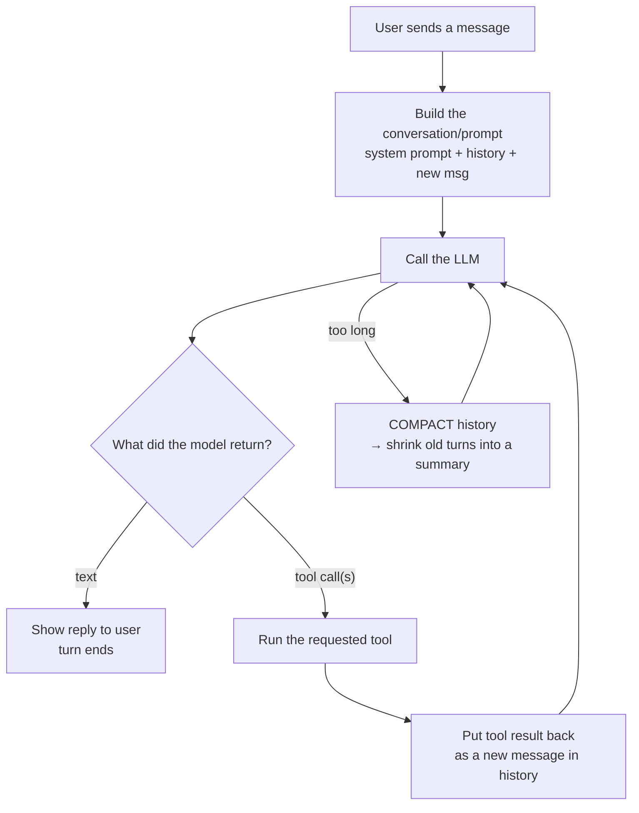
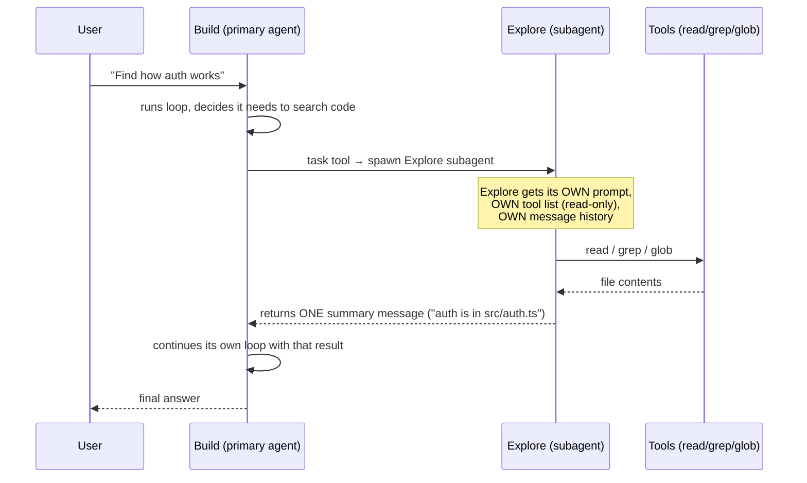
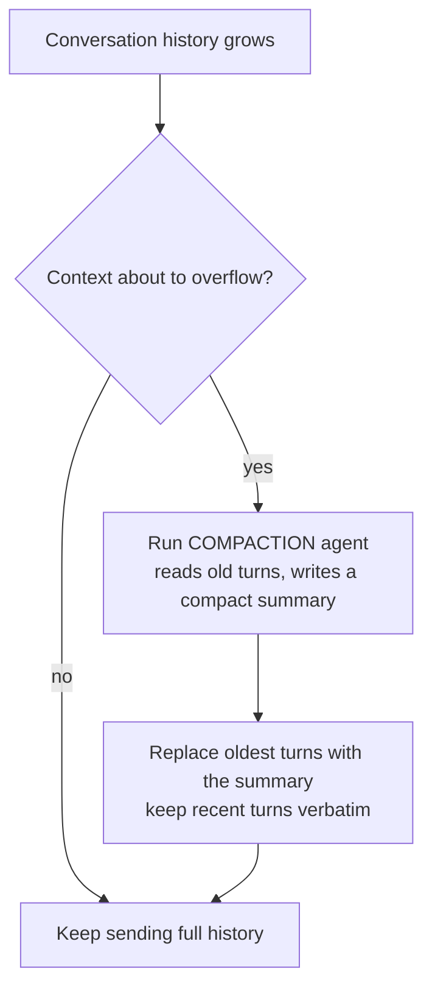
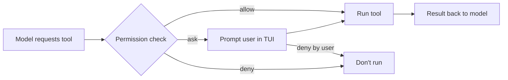

# opencode Architecture (Simplified)

OpenCode is an open-source AI coding agent. It is **not** a single LLM call — it is a
collection of **agents** and **tools** arranged in a loop. This document explains the
whole thing in simple terms with diagrams.

Source: `github.com/anomalyco/opencode` (branch `dev`), the core package is
`packages/opencode/src/`.

---

## 1. The Big Picture

```
┌──────────────────────────────────────────────────────────────────────┐
│                         USER (you, in the TUI)                       │
└────────────────────────────────┬─────────────────────────────────────┘
                                 │ you type a message
                                 ▼
┌──────────────────────────────────────────────────────────────────────┐
│                      SESSION (src/session/)                          │
│   - holds the conversation history (messages)                        │
│   - compacts history when it gets too long ("memory")                │
│   - runs the agent loop (processor.ts)                               │
└────────────────────────────────┬─────────────────────────────────────┘
                                 │ feeds the prompt
                                 ▼
┌──────────────────────────────────────────────────────────────────────┐
│                   AGENT  (src/agent/agent.ts)                        │
│   Build  (primary - all tools, does the work)                        │
│   Plan   (primary - read-only, plans only)                           │
│   + hidden agents: compaction, summary, title                        │
└────────────────────────────────┬─────────────────────────────────────┘
                                 │ the model returns: text OR tool calls
                                 ▼
┌──────────────────────────────────────────────────────────────────────┐
│                        TOOLS  (src/tool/)                            │
│   read, write, edit, bash/shell, grep, glob, webfetch, websearch,    │
│   todo, permission, question, lsp, ... and  TASK (spawns subagents)  │
└──────────────────────────────────────────────────────────────────────┘
```

The **agent loop** repeats: **prompt → model answers → tool runs → result goes
back into the conversation → model answers again → …** until the model sends a
final text reply or hits the step limit.

---

## 2. The Agent Loop (the heart of it)

Every "turn" is a loop, not one response. This is in `src/agent/agent.ts`
and `src/session/processor.ts`.



Key insight: the **tools** are how the agent touches your computer. The model
doesn't run anything itself — it *asks* for a tool, opencode runs it, and the
result is fed back so the model can decide the next step.

---

## 3. Agents vs Subagents (coordination)

There are two kinds: **primary agents** (what you talk to) and **subagents**
(specialized helpers spawned on demand). This lives in `src/agent/` and the
`task` tool in `src/tool/task.ts`.

### Built-in agents

| Agent | Type | What it does |
|---|---|---|
| **build** | primary | Default. Full tool access. Does the actual work. |
| **plan** | primary | Read-only (mostly `ask`/`deny`). Plans without editing. |
| **general** | subagent | General helper, full tools, used for units of work. |
| **explore** | subagent | Fast, read-only. Searches/reads the codebase. |
| **scout** | subagent | Read-only. Clones & inspects external dependency source. |
| **compaction** | hidden | Compresses long context into a summary ("memory"). |
| **summary** | hidden | Creates session summaries. |
| **title** | hidden | Names the session. |

### How a primary agent spawns a subagent

The primary agent uses the **`task` tool** (the "Subagent" tool) to delegate.
The subagent gets: its own **system prompt**, a subset of **tools**, and its
own **message history**. When the subagent finishes, its final message is
returned to the primary agent as a single tool result.



- The **`subagent_permissions`** (`subagent-permissions.ts`) decides which tools
  a subagent may use based on its `mode` / permissions — e.g. `explore` is
  read-only because its config denies edit/bash.
- Subagents often get a **smarter or cheaper model** override (set per agent).
- Subagents **do not share memory** with the parent by default — they only
  hand back their final result. That is how coordination stays clean: the
  parent decides, the child executes and reports.

---

## 4. Where "memory" comes from (compaction & summary)

OpenCode does **not** use LangChain's `ConversationSummaryMemory`. Its memory is
implemented with **hidden LLM agents** over the session. Files:
`src/session/compaction.ts`, `src/session/summary.ts`, `src/session/overflow.ts`.



- **Compaction** kicks in automatically right before the window fills. It
  summarises the *old* messages and drops them, keeping the *recent* context
  exact. This is conceptually like LangChain's *summary buffer*, but built
  in-house with a hidden agent, not a library class.
- **Summary** maintains a persistent, higher-level summary of the session.
- **Tool-truncation** (`src/tool/truncate.ts`) trims oversized tool outputs
  (e.g. a huge `read`) so they don't blow the window.

---

## 5. Tools & Permissions

Every capability the agent has is a **tool** registered in `src/tool/`:
`task.ts` (subagents), `shell.ts`, `edit.ts`, `write.ts`, `read.ts`, `grep.ts`,
`glob.ts`, `webfetch.ts`, `websearch.ts`, `todo.ts`, `question.ts`, `lsp.ts`,
`registry.ts`, `truncate.ts`, plus the `task.*.txt` tool-usage prompts.

The **permission system** (`src/permission/`, `src/agent/subagent-permissions.ts`)
gates each tool. Values: `allow`, `ask`, `deny` — and can be a glob of paths
(e.g. `bash: { "git push": "ask" }`).



---

## 6. Surrounding Pieces (brief)

| Area | Source dir | Purpose |
|---|---|---|
| **Session** | `session/` | History, compaction, the agent loop |
| **Agent** | `agent/` | Agent runtime + agent generation prompt |
| **Tools** | `tool/` | Everything the model can call |
| **Providers / Models** | `provider/` | Plug in LLM providers (OpenAI, Anthropic, etc.) |
| **MCP** | `mcp/` | External model-context-protocol servers (extra tools) |
| **LSP** | `lsp/` | Language servers for code intelligence |
| **Permissions** | `permission/` | allow/ask/deny rules per tool |
| **Config** | `config/` | `opencode.json` + agent definitions |
| **Storage** | `storage/` | Persist sessions, messages, state (SQLite) |
| **Project** | `project/` | Workspace/project resolution, AGENTS.md rules |
| **Plugin** | `plugin/` | Extend opencode with plugins |
| **Server / SDK** | `server/` | The REST server / client SDK |
| **CLI / TUI / IDE** | `cli/`, `tui`, `ide` | User interfaces |

---

## 7. One-sentence summary

OpenCode = **an agent loop** (model ⇄ tools) where a **primary agent** can
spawn **subagents** via the `task` tool to do focused work and report back, and
where **context length is managed by a hidden "compaction" agent** that
summarises old turns when the window fills — plus a **permission system** that
gates every tool call.

---

*Based on `anomalyco/opencode` `dev` branch, `packages/opencode/src/`. Sep 2026.*
